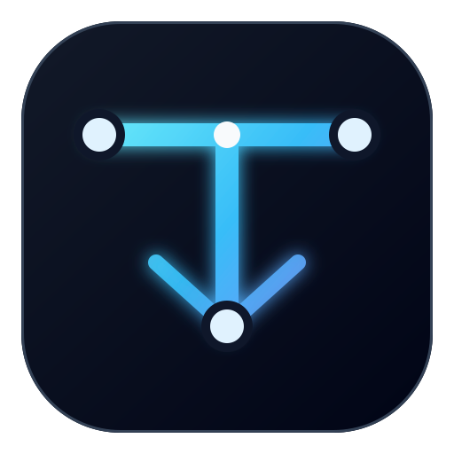

<p align="center">
  
</p>

<h1 align="center">Tautline</h1>

<p align="center">
  <strong>A context-safe, local-first MCP control plane for ChatGPT.</strong><br />
  Workspace tools, compact MCP Apps widgets, controlled sub-agents, Lightpanda browsing, and Cloudflare Tunnel in one Go runtime.
</p>

<p align="center">
  <a href="https://github.com/Dimasnotfound/devspace-mcp/actions/workflows/ci.yml"></a>
  
  
  <a href="LICENSE"></a>
</p>

<p align="center">
  
</p>

> The repository keeps its historical `devspace-mcp` URL for compatibility, while the application and current release line use the **Tautline** name.

## Overview

Tautline lets ChatGPT work with explicitly allowed local project folders without placing an entire repository into the conversation. It provides bounded file and command tools, secure large-output artifacts, local dashboard controls, MCP Apps widgets, optional 9Router sub-agents, Lightpanda page rendering, and Cloudflare Tunnel integration.

The server is local-first: repositories are not bulk-uploaded, while runtime state, credentials, and command execution remain on the machine running Tautline. Content selected for a ChatGPT request or delegated sub-agent may be transmitted to the configured model provider. Public access to `/mcp` is protected by OAuth unless authentication is deliberately disabled for an isolated local test.

## What is new in v2.1.0

- **Global sub-agent control** — pause or resume all new delegation from the dashboard.
- **Per-slot controls** — enable capacity, image tasks, RTK compaction, and Caveman output independently.
- **Strict model allowlist** — configure multiple permitted 9Router models and select one default model.
- **Runtime enforcement** — both the requested model and the model actually returned by 9Router must be allowed.
- **Cleaner dashboard** — shorter labels, clearer controls, model cards, responsive layout, and a local application icon.
- **Regression coverage** — tests cover global delegation, requested and returned model rejection, allowlist normalization, and embedded dashboard assets.

## Main capabilities

| Area | Capability |
|---|---|
| Workspace | Open only configured roots, search files, read bounded windows, write atomically, edit exact text, and run bounded commands. |
| Context safety | Keep model-visible responses compact and move oversized command output into secure local artifacts. |
| MCP Apps | Render compact workspace and change-review cards, or enable the full per-tool widget experience. |
| Dashboard | Manage runtime settings, model access, sub-agent capacity, Lightpanda, and Cloudflare Tunnel locally. |
| Sub-agents | Delegate asynchronous tasks through an OpenAI-compatible 9Router endpoint with explicit capability gates. |
| Browser | Fetch and render pages with Lightpanda only; no Chrome fallback is used. |
| Skills | Discover installed Hermes skills through a read-only bridge before non-trivial work. |
| Security | OAuth + PKCE, canonical path enforcement, local admin sessions, CSRF protection, bounded output, and narrow allowed roots. |

## Architecture

<p align="center">
  
</p>

Tautline separates three kinds of data:

- **Model-visible data** — concise structured results needed for reasoning and follow-up calls.
- **Widget-only data** — richer presentation data delivered through MCP tool-result metadata.
- **Local-only data** — source files, secrets, command processes, runtime configuration, and stored artifacts.

## Requirements

- Go 1.24 or newer.
- Git.
- Python 3 for the Hermes skill bridge syntax check.
- Node.js for dashboard JavaScript validation during builds.
- A ChatGPT client that supports remote MCP servers and MCP Apps.
- A stable HTTPS origin when connecting ChatGPT to a machine outside the client.
- Optional: 9Router, Lightpanda, Docker or WSL2, and `cloudflared`.

## Quick start

### Windows PowerShell

```powershell
git clone https://github.com/Dimasnotfound/devspace-mcp.git
cd devspace-mcp

./scripts/setup.ps1 -AllowedRoots "D:\Projects"
./scripts/build.ps1
./scripts/start.ps1
```

`setup.ps1` creates a private `.env` file and generates a random owner token. The token is not printed to the terminal.

### macOS or Linux

```bash
git clone https://github.com/Dimasnotfound/devspace-mcp.git
cd devspace-mcp

cp .env.example .env
# Edit .env and set a narrow TAUTLINE_ALLOWED_ROOTS value and a random owner token.

./scripts/build.sh
./scripts/start.sh
```

The local dashboard opens by default at `http://127.0.0.1:7688`.

## Default endpoints

| Component | Default |
|---|---|
| Dashboard | `http://127.0.0.1:7688` |
| MCP | `http://127.0.0.1:7688/mcp` |
| Health | `http://127.0.0.1:7688/healthz` |
| 9Router | `http://127.0.0.1:20128/v1` |
| Lightpanda CDP | `http://127.0.0.1:9223` |
| Runtime directory | `runtime/v2/` |
| Main widget | `ui://tautline/tool-card-v2.html` |

## Core MCP tools

| Category | Tools |
|---|---|
| Workspace | `open_workspace`, `search`, `read`, `write`, `edit`, `bash`, `show_changes` |
| Large output | `artifact_read` |
| Skills | `skills_search`, `skill_view`, `skill_read_file` |
| Sub-agents | `list_subagents`, `delegate_task`, `get_agent_run`, `cancel_agent_run` |
| Browser | `lightpanda_fetch` |

After `open_workspace`, all filesystem operations use paths relative to the returned `workspace_id`. Canonical paths and symlink targets are checked against `TAUTLINE_ALLOWED_ROOTS`.

## Widget modes

Set `TAUTLINE_WIDGETS` in `.env`:

| Value | Behavior |
|---|---|
| `changes` | Compact workspace card plus one aggregate review after edits. This is the default. |
| `full` | Workspace, file, diff, command, and change-review widgets. |
| `off` | Text results only. |

## 9Router and sub-agents

Tautline sends delegated requests only to an OpenAI-compatible 9Router endpoint. Provider accounts, aliases, fallback rules, and routing remain the responsibility of 9Router.

The dashboard stores one default model and a list of allowed models. A delegation is accepted only when:

1. global sub-agent delegation is enabled;
2. an enabled slot is available;
3. the requested model is in `TAUTLINE_9ROUTER_ALLOWED_MODELS`;
4. the model returned by 9Router is also in the allowlist;
5. image requests pass every explicit image capability gate.

Disabling sub-agents blocks new delegation. It does not forcibly terminate a run that was already active; use `cancel_agent_run` for that run.

Relevant variables:

```env
TAUTLINE_9ROUTER_BASE_URL=http://127.0.0.1:20128/v1
TAUTLINE_9ROUTER_API_KEY=
TAUTLINE_9ROUTER_MODEL=auto
TAUTLINE_9ROUTER_ALLOWED_MODELS=auto
TAUTLINE_AGENT_ENABLED=true
TAUTLINE_AGENT_CAPACITY=2
TAUTLINE_AGENT_TIMEOUT_SECONDS=900
```

## Lightpanda

Tautline does not use Chrome or Chromium as a fallback. In `auto` mode it resolves Lightpanda in this order:

1. the configured executable;
2. `lightpanda` on `PATH`;
3. Docker using `lightpanda/browser:nightly`;
4. a supported WSL2 installation on Windows.

Image buffers and delegated image payloads are kept in memory for the request and are not intentionally written into run state, configuration, logs, or runtime files.

## Cloudflare Tunnel

The local dashboard supports quick tunnels, named tunnels, and custom-domain DNS routing through `cloudflared`. Named tunnel and DNS operations require an existing local Cloudflare login and an accessible zone.

Set `TAUTLINE_PUBLIC_BASE_URL` and `TAUTLINE_WIDGET_DOMAIN` to the exact public HTTPS origin used by ChatGPT. Do not include `/mcp` in the origin value.

## Configuration

Copy [`.env.example`](.env.example) and review every value. The most important settings are:

| Variable | Purpose |
|---|---|
| `TAUTLINE_ALLOWED_ROOTS` | Comma-separated folders Tautline may access. Keep this narrow. |
| `TAUTLINE_OWNER_TOKEN` | Secret used during OAuth owner authorization. |
| `TAUTLINE_REQUIRE_AUTH` | Keep `true` for any public deployment. |
| `TAUTLINE_PUBLIC_BASE_URL` | Public HTTPS origin used by OAuth metadata. |
| `TAUTLINE_WIDGET_DOMAIN` | Stable HTTPS origin declared for MCP Apps widgets. |
| `TAUTLINE_WIDGETS` | `changes`, `full`, or `off`. |
| `TAUTLINE_AGENT_ENABLED` | Global switch for new sub-agent delegation. |
| `TAUTLINE_9ROUTER_ALLOWED_MODELS` | Comma-separated model allowlist. |
| `TAUTLINE_LIGHTPANDA_PATH` | `auto`, `docker`, `wsl`, or an executable path. |
| `TAUTLINE_TUNNEL_MODE` | `off`, `quick`, or `named`. |

Dashboard changes are saved atomically to `runtime/v2/config/tautline.json`. Environment variables override stored configuration at startup.

## Security

Tautline can modify files and execute commands inside configured roots. Treat it as privileged development software.

- Keep `TAUTLINE_ALLOWED_ROOTS` limited to project directories.
- Never expose `/mcp` with `TAUTLINE_REQUIRE_AUTH=false`.
- Never commit `.env`, owner tokens, tunnel credentials, logs, runtime state, or binaries.
- Keep the dashboard local; it binds to `127.0.0.1` and requires a bootstrap-derived admin session.
- Review tool approvals and delegated output before applying changes.
- Read [SECURITY.md](SECURITY.md) before using a public tunnel.

## Connect to ChatGPT

See [docs/CHATGPT_SETUP.md](docs/CHATGPT_SETUP.md) for the complete OAuth, tunnel, and MCP connection flow.

The standard context-safe coding loop is documented in [docs/CODING_WORKFLOW.md](docs/CODING_WORKFLOW.md).

## Development

Run the same checks used by CI:

```bash
./scripts/build.sh
```

Or run them individually:

```bash
test -z "$(gofmt -l .)"
TAUTLINE_WIDGET_DOMAIN= TAUTLINE_PUBLIC_BASE_URL= go test ./...
go vet ./...
go build ./cmd/tautline
node --check cmd/tautline/web/app.js
python -m py_compile cmd/tautline/bridge/hermes_skill_bridge.py
```

The main executable is built from `cmd/tautline`. The optional Windows-to-WSL Lightpanda shim is built from `cmd/lightpanda-shim`.

## Repository layout

```text
.
├── .github/workflows/           # CI and secret scanning
├── assets/                      # Public README artwork
├── cmd/
│   ├── tautline/                # Main Tautline executable package
│   │   ├── bridge/              # Embedded Hermes read-only bridge
│   │   ├── web/                 # Embedded dashboard assets and icon
│   │   ├── *_test.go            # Package-level regression tests
│   │   └── *.go                 # Runtime, tools, UI, agents, OAuth, and tunnel code
│   └── lightpanda-shim/         # Optional Windows-to-WSL Lightpanda shim
├── docs/                        # ChatGPT setup and coding workflow guides
├── runtime/                     # Ignored local runtime state; only .gitkeep is tracked
├── scripts/                     # Setup, build, and start helpers
├── .env.example                 # Safe configuration template
├── go.mod                       # Go module definition
└── README.md                    # Project overview and usage
```

See [`cmd/tautline/README.md`](cmd/tautline/README.md) for a concise map of the executable package files.

## Migration from DevSpace

1. Replace `DEVSPACE_*` variables with their `TAUTLINE_*` equivalents.
2. Build and run `tautline` instead of `devspace`.
3. Change the local origin from port `7676` to `7688`, or set `TAUTLINE_PORT` explicitly.
4. Update the public MCP origin and refresh the connection metadata in ChatGPT.
5. Keep the previous runtime directory until Tautline v2.1.0 is confirmed healthy.

Selected legacy aliases remain for migration compatibility, but new configuration and documentation use `TAUTLINE_*` names.

## Contributing

Contributions are welcome. Read [CONTRIBUTING.md](CONTRIBUTING.md), run the complete quality gate, and do not include machine-specific configuration or secrets.

## License

Tautline is released under the [MIT License](LICENSE).

Tautline is an independent open-source project and is not affiliated with or endorsed by OpenAI, Cloudflare, Lightpanda, or any model provider. Their names and trademarks belong to their respective owners.
