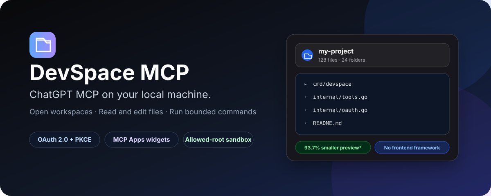
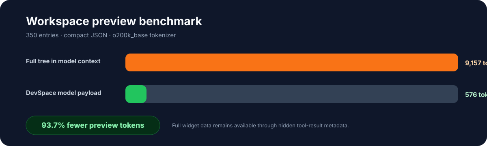
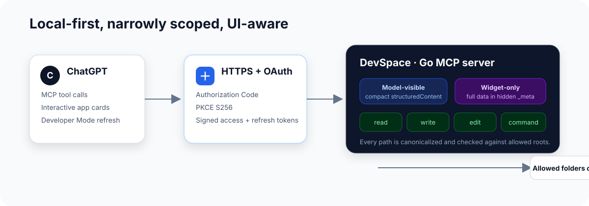

<p align="center">
  
</p>

<p align="center">
  <strong>Bring ChatGPT to your local codebase without pasting the whole project into the chat.</strong>
</p>

<p align="center">
  <a href="https://github.com/dimasnotfound/devspace-mcp/actions/workflows/ci.yml"></a>
  <a href="LICENSE"></a>
  
  
  
</p>

# DevSpace MCP

**DevSpace is a local-first MCP server that lets ChatGPT inspect selected workspaces, read and modify files, run bounded commands, and render native-looking interactive cards inside the conversation.**

Your source code stays on your machine. DevSpace exposes only the directories listed in `DEVSPACE_ALLOWED_ROOTS`, protects the remote MCP endpoint with OAuth 2.0 + PKCE, and keeps large widget-only data outside the model-visible context whenever possible.

> **ChatGPT MCP on your local machine — fast enough for daily development, narrow enough to understand, and secure enough to configure deliberately.**

## Why DevSpace?

| Problem | DevSpace approach |
|---|---|
| Repeatedly pasting files into ChatGPT | Read only the file or repository view requested by the model |
| Huge repository trees consuming context | Send a compact model preview while hydrating the full widget through hidden MCP metadata |
| Generic text-only MCP output | Render dedicated workspace, file, diff, and command cards |
| Public MCP endpoint risk | Require OAuth bearer tokens with Authorization Code + PKCE S256 |
| Accidental access outside the project | Canonicalize paths, resolve symlinks, and enforce explicit allowed roots |
| Commands that never stop | Apply timeouts, cancellation, bounded output, and process-tree termination |

## Up to 93.7% fewer workspace-preview tokens

<p align="center">
  
</p>

For a synthetic repository containing 350 entries, the included benchmark measured:

| Payload | JSON bytes | `o200k_base` tokens |
|---|---:|---:|
| Full workspace tree in model context | 30,424 | 9,157 |
| DevSpace compact model preview | 1,946 | 576 |
| **Reduction** | **93.6%** | **93.7%** |

DevSpace sends the compact preview through `structuredContent`, which is visible to the model, while the complete tree can be delivered to the widget through tool-result `_meta`, which MCP Apps keeps hidden from the model.

Run the benchmark yourself:

```bash
python scripts/payload_benchmark.py
```

`pip install tiktoken` is optional and only needed to reproduce the token count. Without it, the script still reports byte reduction.

> The 93.7% figure applies to this repository-preview benchmark, not every tool call and not an entire ChatGPT bill. Actual token usage depends on repository shape, selected tools, model tokenizer, conversation history, and ChatGPT behavior.

## Codex-style coding workflow

The default `DEVSPACE_WIDGETS=changes` mode follows a quieter agent loop:

1. `open_workspace` is called once and returns a reusable `workspace_id`.
2. `read`, `write`, `edit`, and `bash` use relative paths inside that workspace.
3. Individual operations stay as compact native tool results instead of spawning a custom widget each time.
4. After the final file edit, `show_changes` renders one aggregate review card.
5. The assistant runs verification and gives a short final summary.

Only two custom cards are active by default: a small workspace card and one final change-review card. Set `DEVSPACE_WIDGETS=full` to restore file, per-edit diff, and command widgets, or `off` to disable custom UI completely.

See [docs/CODING_WORKFLOW.md](docs/CODING_WORKFLOW.md) for the complete tool loop and checkpoint behavior.

Every widget is plain HTML, CSS, and JavaScript embedded in the Go binary. There is no React runtime, CDN, remote font, external script, WebSocket, or frontend build step.

## Architecture

<p align="center">
  
</p>

The important separation is:

- **Model-visible:** concise `structuredContent` used for reasoning and follow-up tool calls.
- **Widget-only:** richer UI hydration data in tool-result `_meta`.
- **Local-only:** files, commands, secrets, and runtime state remain on the machine running DevSpace.

## Security model

DevSpace is powerful software. It can modify files and execute commands inside configured roots, so install it only on a machine you control.

Security protections include:

- OAuth 2.0 Authorization Code flow with PKCE S256.
- Signed one-hour access tokens and 30-day refresh tokens.
- Authentication enabled by default.
- Canonical path and symlink validation before every filesystem operation.
- Explicit comma-separated allowed roots.
- Atomic UTF-8 writes and unique-match edits.
- Read limits, command-output limits, timeouts, and cancellation.
- MCP widget CSP with no external connection or resource domains.
- `.gitignore` coverage for `.env`, tokens, runtime files, logs, certificates, and binaries.

Read [SECURITY.md](SECURITY.md) before exposing DevSpace through a tunnel.

## Requirements

- Go 1.24 or newer.
- Git.
- ChatGPT Developer Mode for MCP App UI.
- A public HTTPS endpoint that forwards to `127.0.0.1:7676` when connecting from ChatGPT.
- Optional: Cloudflare Tunnel and Git Bash on Windows.

## Quick start — Windows

```powershell
git clone https://github.com/dimasnotfound/devspace-mcp.git
cd devspace-mcp

# Generate a private .env and owner token.
.\scripts\setup.ps1 `
  -AllowedRoots "D:\Projects" `
  -PublicBaseUrl "https://mcp.example.com"

# Build and test.
.\scripts\build.ps1

# Start locally without an automatic tunnel.
.\scripts\start.ps1
```

To let the start script launch a configured Cloudflare named tunnel:

```powershell
.\scripts\setup.ps1 `
  -AllowedRoots "D:\Projects" `
  -PublicBaseUrl "https://mcp.example.com" `
  -TunnelName "devspace" `
  -StartTunnel `
  -Force

.\scripts\start.ps1 -Tunnel
```

## Quick start — macOS/Linux

```bash
git clone https://github.com/dimasnotfound/devspace-mcp.git
cd devspace-mcp
cp .env.example .env

# Edit .env and replace every example value.
./scripts/build.sh
./bin/devspace -start -tunnel=false
```

The MCP endpoint is available at:

```text
http://127.0.0.1:7676/mcp
```

The health endpoint is:

```text
http://127.0.0.1:7676/healthz
```

## Connect from ChatGPT

1. Expose the local server through a stable public HTTPS origin.
2. Set that origin in `DEVSPACE_PUBLIC_BASE_URL`.
3. In ChatGPT, enable **Developer mode** and **Enforce CSP in developer mode**.
4. Create a developer-mode app using `https://your-domain.example/mcp`.
5. Complete OAuth using your owner token.
6. Refresh the app metadata after changing tool descriptors or widget URIs.
7. Select DevSpace in the conversation and ask it to open a path inside an allowed root.

Example prompt:

```text
Use DevSpace to open D:\Projects\my-app and explain the repository structure.
```

## Configuration

Copy `.env.example` to `.env` or run `scripts/setup.ps1`.

| Variable | Default | Description |
|---|---|---|
| `DEVSPACE_ALLOWED_ROOTS` | `.` | Comma-separated directories available to tools |
| `DEVSPACE_OWNER_TOKEN` | Temporary random token | Secret used for approval and token signing |
| `DEVSPACE_REQUIRE_AUTH` | `true` | Bearer validation; never disable on a public endpoint |
| `DEVSPACE_WIDGETS` | `changes` | `changes`, `full`, or `off` custom UI mode |
| `DEVSPACE_SHOW_OWNER_TOKEN` | `false` | Display a configured token in startup output |
| `DEVSPACE_PUBLIC_BASE_URL` | Derived from request | Stable public HTTPS origin for OAuth metadata |
| `DEVSPACE_START_TUNNEL` | `false` | Start a named Cloudflare tunnel automatically |
| `DEVSPACE_TUNNEL_NAME` | empty | Cloudflare named tunnel |
| `DEVSPACE_TUNNEL_PROTOCOL` | automatic | Optional `http2` or `quic` selection |
| `DEVSPACE_CLOUDFLARED_PATH` | PATH or `bin/` | Optional cloudflared executable location |
| `DEVSPACE_SHELL` | platform default | Optional shell executable override |
| `DEVSPACE_RUNTIME_DIR` | `runtime` | PID-file directory |

## Tool safety limits

| Limit | Value |
|---|---:|
| Workspace entries | 350 |
| Workspace depth | 5 |
| Model-visible workspace entries | 20 |
| Default file read | 64 KiB |
| Maximum file read | 256 KiB |
| Command output | 128 KiB |
| Default command timeout | 120 seconds |
| Maximum command timeout | 300 seconds |

## Project structure

```text
.
├── cmd/devspace/             # Go MCP server, OAuth, tools, and embedded widgets
├── assets/                   # README visuals
├── docs/                     # Architecture and operational documentation
├── scripts/                  # Setup, build, start, and benchmark helpers
├── .github/workflows/ci.yml  # Linux/Windows CI and secret scanning
├── .env.example              # Safe configuration template
├── SECURITY.md
├── CONTRIBUTING.md
└── LICENSE
```

## Development

```bash
go fmt ./...
go test ./...
go vet ./...
go build ./cmd/devspace
```

See [CONTRIBUTING.md](CONTRIBUTING.md) for widget and security requirements.

## Roadmap

- Optional Codex-style `apply_patch` and long-running process sessions.
- Cursor-based directory expansion for very large monorepos.
- Optional Git status and branch summaries.
- More granular command policies.
- Signed release binaries and checksums.
- Additional operating-system packaging.

## License

MIT © 2026 Dimas Juli Pratama.

## Disclaimer

DevSpace is an independent open-source project and is not affiliated with or endorsed by OpenAI. ChatGPT and OpenAI are trademarks of their respective owners. Cloudflare Tunnel is optional and governed by Cloudflare's own terms and documentation.
